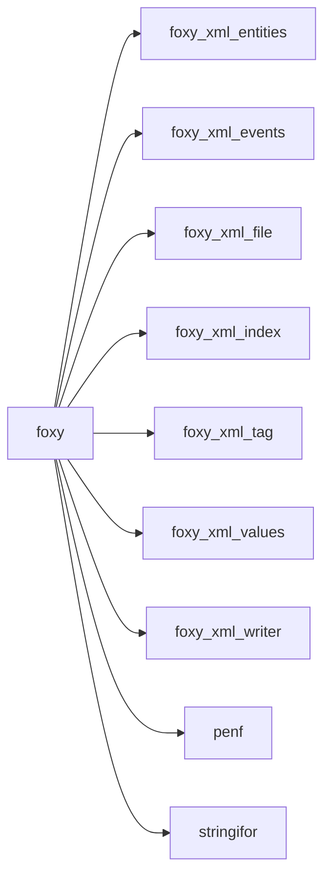

# foxy

> FoXy, Fortran XML parser for poor people

**Source**: `src/third_party/FoXy/src/lib/foxy.f90`

**Dependencies**

```mermaid
graph LR
  foxy["foxy"] --> foxy_xml_entities["foxy_xml_entities"]
  foxy["foxy"] --> foxy_xml_events["foxy_xml_events"]
  foxy["foxy"] --> foxy_xml_file["foxy_xml_file"]
  foxy["foxy"] --> foxy_xml_index["foxy_xml_index"]
  foxy["foxy"] --> foxy_xml_tag["foxy_xml_tag"]
  foxy["foxy"] --> foxy_xml_values["foxy_xml_values"]
  foxy["foxy"] --> foxy_xml_writer["foxy_xml_writer"]
  foxy["foxy"] --> penf["penf"]
  foxy["foxy"] --> stringifor["stringifor"]
```
