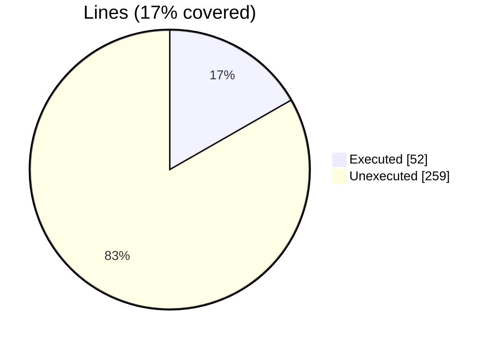
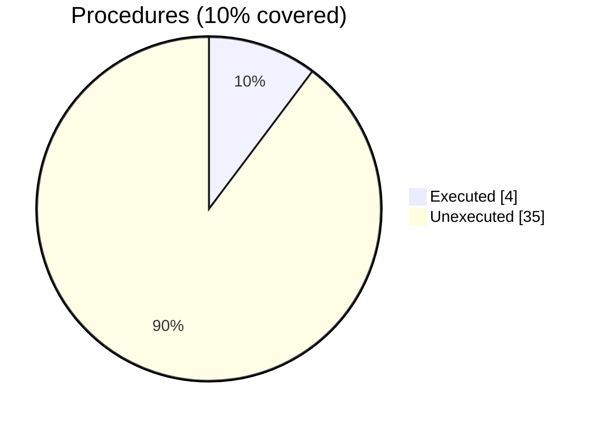

### Coverage analysis of *befor64.F90*

|Lines| | |
| --- | --- | --- |
|Executable lines            |311| |
|Executed lines              |52|17%|
|Unexecuted lines            |259|83%|
|Average hits / executed     |4.230769230769231| |

|Procedures| | |
| --- | --- | --- |
|Total procedures            |39| |
|Executed procedures         |4|10%|
|Unexecuted procedures       |35|90%|
|Average hits / executed     |1.25| |

#### Unexecuted procedures

 + *subroutine* **b64_decode_I1**, line 922
 + *subroutine* **b64_decode_I1_a**, line 1083
 + *subroutine* **b64_decode_I2**, line 902
 + *subroutine* **b64_decode_I2_a**, line 1063
 + *subroutine* **b64_decode_I4**, line 882
 + *subroutine* **b64_decode_I4_a**, line 1043
 + *subroutine* **b64_decode_I8**, line 862
 + *subroutine* **b64_decode_I8_a**, line 1023
 + *subroutine* **b64_decode_R16**, line 802
 + *subroutine* **b64_decode_R16_a**, line 963
 + *subroutine* **b64_decode_R4**, line 842
 + *subroutine* **b64_decode_R4_a**, line 1003
 + *subroutine* **b64_decode_R8**, line 822
 + *subroutine* **b64_decode_R8_a**, line 983
 + *subroutine* **b64_decode_string_a**, line 1103
 + *subroutine* **b64_decode_up**, line 348
 + *subroutine* **b64_decode_up_a**, line 380
 + *subroutine* **b64_encode_I1**, line 554
 + *subroutine* **b64_encode_I1_a**, line 752
 + *subroutine* **b64_encode_I2**, line 531
 + *subroutine* **b64_encode_I2_a**, line 727
 + *subroutine* **b64_encode_I4**, line 508
 + *subroutine* **b64_encode_I4_a**, line 702
 + *subroutine* **b64_encode_I8**, line 485
 + *subroutine* **b64_encode_I8_a**, line 677
 + *subroutine* **b64_encode_R16**, line 412
 + *subroutine* **b64_encode_R16_a**, line 602
 + *subroutine* **b64_encode_R4**, line 462
 + *subroutine* **b64_encode_R4_a**, line 652
 + *subroutine* **b64_encode_R8**, line 439
 + *subroutine* **b64_encode_R8_a**, line 627
 + *subroutine* **b64_encode_string_a**, line 777
 + *subroutine* **b64_encode_up**, line 284
 + *subroutine* **b64_encode_up_a**, line 316
 + *subroutine* **b64_init**, line 175

#### Executed procedures

 + *subroutine* **decode_bits**: tested **2** times
 + *subroutine* **encode_bits**: tested **1** times
 + *subroutine* **b64_encode_string**: tested **1** times
 + *subroutine* **b64_decode_string**: tested **1** times

 --- 
 Report generated by [FoBiS.py](https://github.com/szaghi/FoBiS)