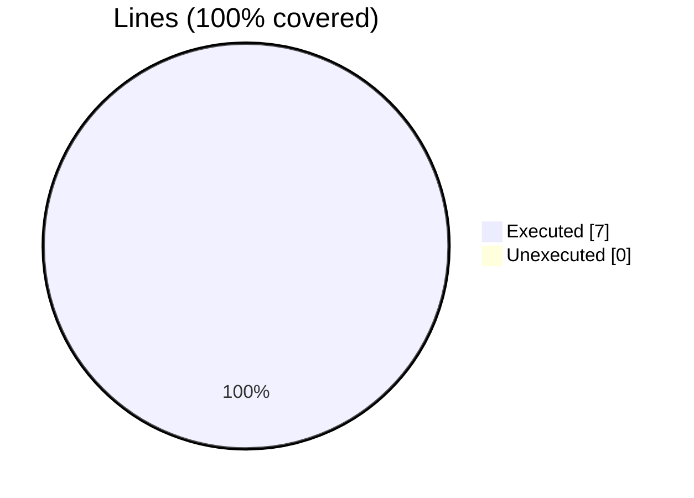
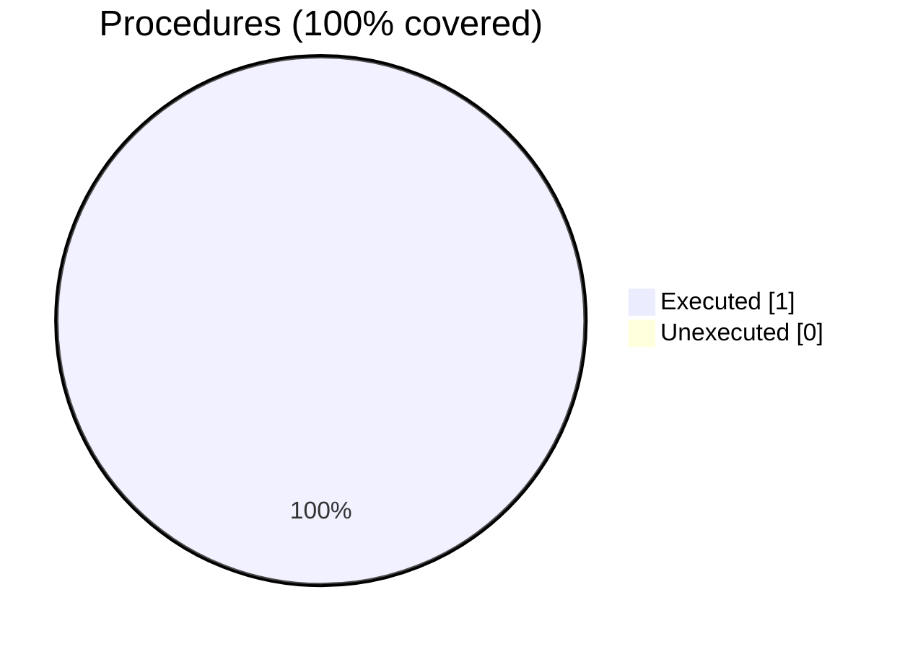
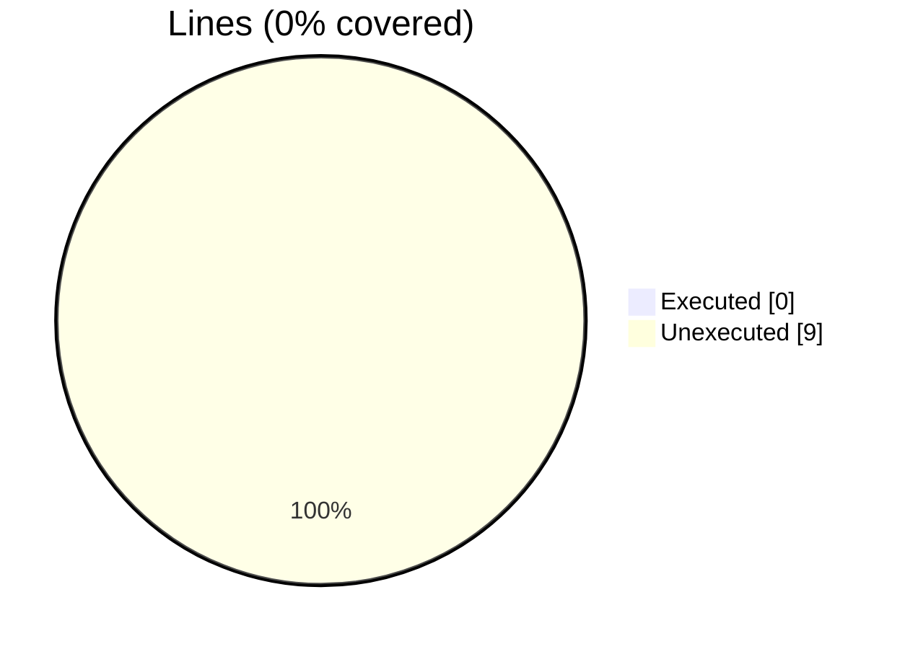
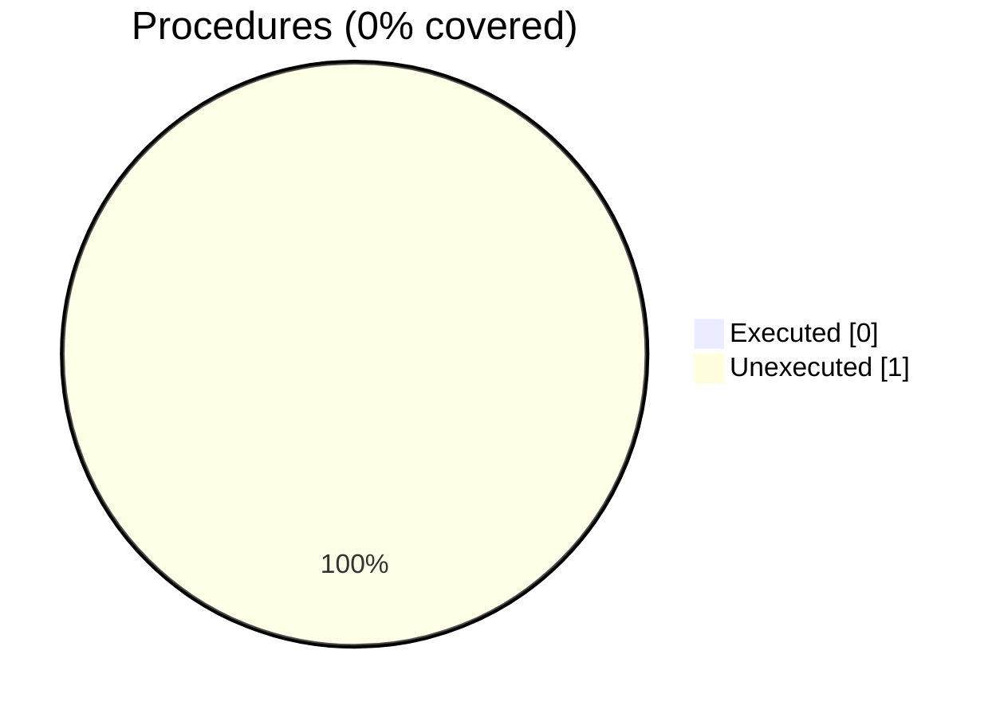
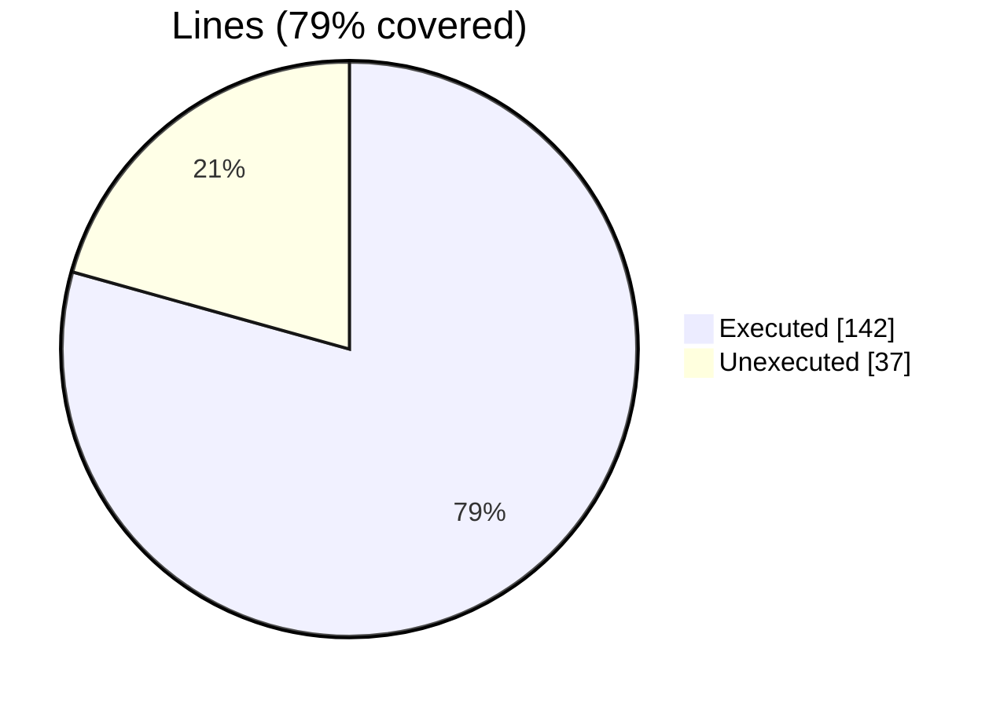
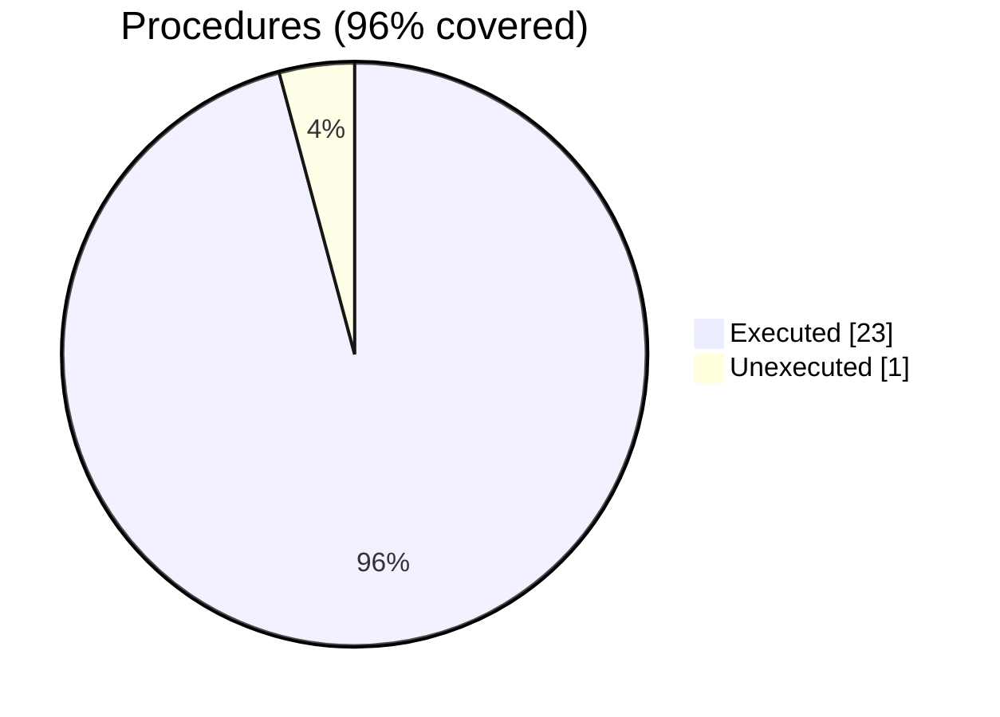
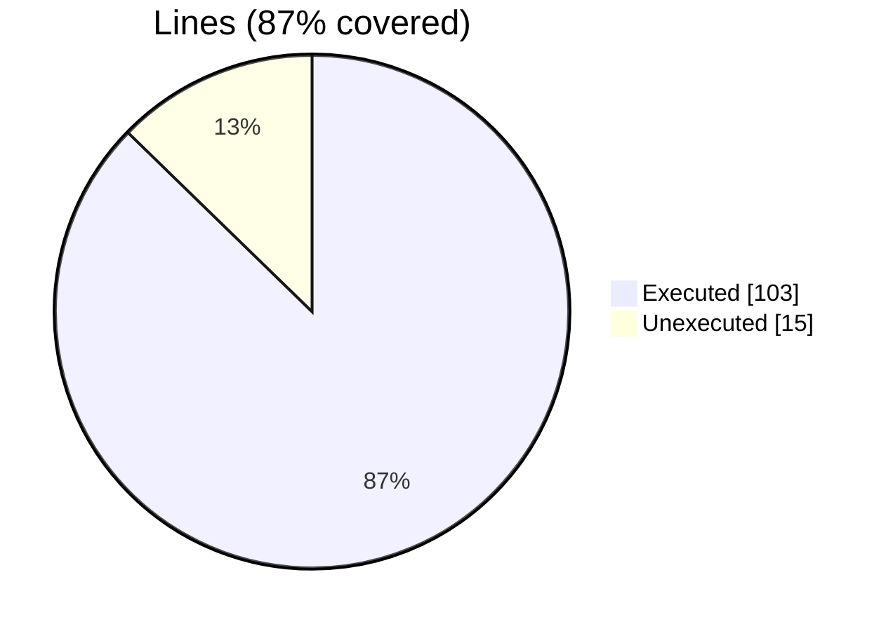
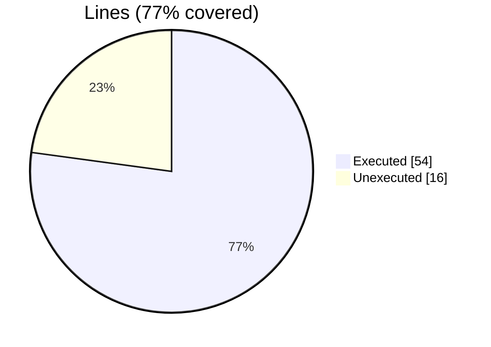
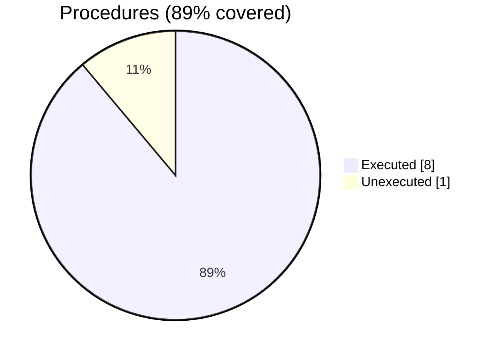

### coverage-analysis

#### [[motion_hdf5_load_save_dataset_agnostic.INC.gcov]]

|Lines| | |
| --- | --- | --- |
|Executable lines            |7| |
|Executed lines              |7|100%|
|Unexecuted lines            |0|0%|
|Average hits / executed     |1.1428571428571428| |

|Procedures| | |
| --- | --- | --- |
|Total procedures            |1| |
|Executed procedures         |1|100%|
|Unexecuted procedures       |0|0%|
|Average hits / executed     |1.0| |

#### [[motion_xh5f_load_save_block_field_agnostic.INC.gcov]]

|Lines| | |
| --- | --- | --- |
|Executable lines            |9| |
|Executed lines              |0|0%|
|Unexecuted lines            |9|100%|
|Average hits / executed     |0| |

|Procedures| | |
| --- | --- | --- |
|Total procedures            |1| |
|Executed procedures         |0|0%|
|Unexecuted procedures       |1|100%|
|Average hits / executed     |0| |

#### [[motion_file_base_object.F90.gcov]]

|Lines| | |
| --- | --- | --- |
|Executable lines            |8| |
|Executed lines              |8|100%|
|Unexecuted lines            |0|0%|
|Average hits / executed     |16.25| |

|Procedures| | |
| --- | --- | --- |
|Total procedures            |1| |
|Executed procedures         |1|100%|
|Unexecuted procedures       |0|0%|
|Average hits / executed     |13.0| |

#### [[motion_xdmf_file_object.F90.gcov]]

|Lines| | |
| --- | --- | --- |
|Executable lines            |179| |
|Executed lines              |142|79%|
|Unexecuted lines            |37|21%|
|Average hits / executed     |571.4507042253521| |

|Procedures| | |
| --- | --- | --- |
|Total procedures            |24| |
|Executed procedures         |23|96%|
|Unexecuted procedures       |1|4%|
|Average hits / executed     |325.39130434782606| |

#### [[motion_xh5f_file_object.F90.gcov]]

|Lines| | |
| --- | --- | --- |
|Executable lines            |118| |
|Executed lines              |103|87%|
|Unexecuted lines            |15|13%|
|Average hits / executed     |195.23300970873785| |

|Procedures| | |
| --- | --- | --- |
|Total procedures            |8| |
|Executed procedures         |8|100%|
|Unexecuted procedures       |0|0%|
|Average hits / executed     |106.125| |

#### [[motion_hdf5_file_object.F90.gcov]]

|Lines| | |
| --- | --- | --- |
|Executable lines            |70| |
|Executed lines              |54|77%|
|Unexecuted lines            |16|23%|
|Average hits / executed     |137.57407407407408| |

|Procedures| | |
| --- | --- | --- |
|Total procedures            |9| |
|Executed procedures         |8|89%|
|Unexecuted procedures       |1|11%|
|Average hits / executed     |205.375| |

