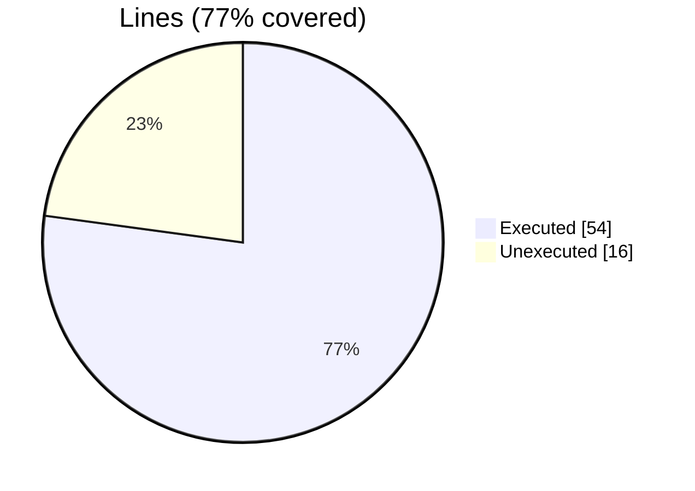
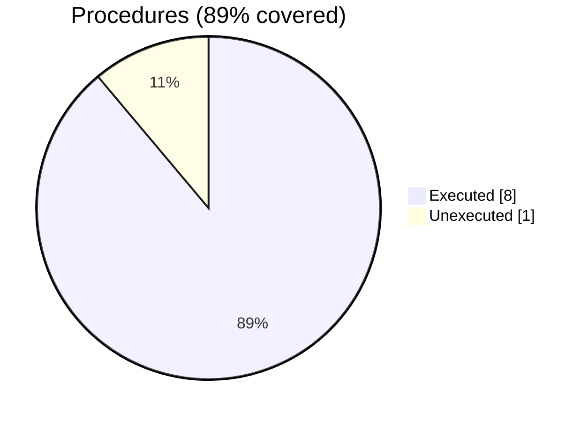

### Coverage analysis of *motion_hdf5_file_object.F90*

|Lines| | |
| --- | --- | --- |
|Executable lines            |70| |
|Executed lines              |54|77%|
|Unexecuted lines            |16|23%|
|Average hits / executed     |137.57407407407408| |

|Procedures| | |
| --- | --- | --- |
|Total procedures            |9| |
|Executed procedures         |8|89%|
|Unexecuted procedures       |1|11%|
|Average hits / executed     |205.375| |

#### Unexecuted procedures

 + *subroutine* **h5f_finalize**, line 290

#### Executed procedures

 + *subroutine* **close_dspace**: tested **810** times
 + *subroutine* **open_dspace**: tested **810** times
 + *function* **new**: tested **5** times
 + *subroutine* **h5f_initialize**: tested **5** times
 + *subroutine* **close_file**: tested **5** times
 + *subroutine* **open_file**: tested **5** times
 + *function* **does_dataset_exist**: tested **2** times
 + *subroutine* **get_dataset_dims**: tested **1** times

 --- 
 Report generated by [FoBiS.py](https://github.com/szaghi/FoBiS)