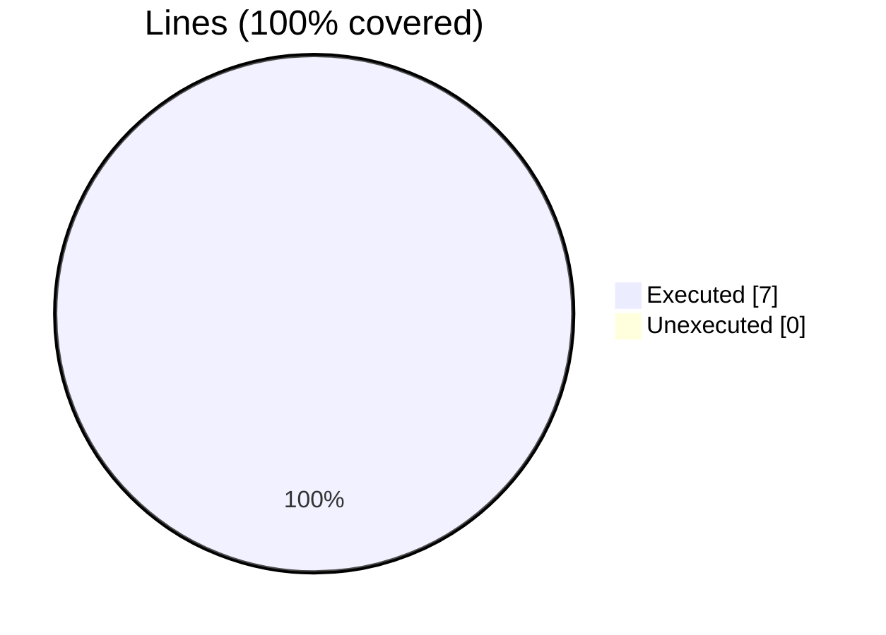
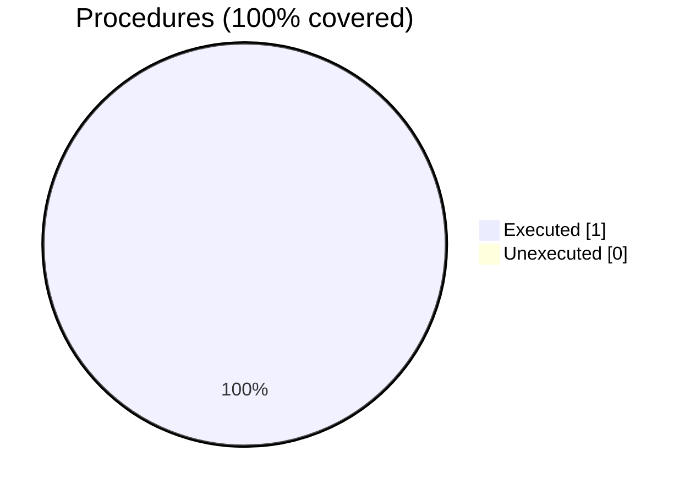

### Coverage analysis of *motion_hdf5_load_save_dataset_agnostic.INC*

|Lines| | |
| --- | --- | --- |
|Executable lines            |7| |
|Executed lines              |7|100%|
|Unexecuted lines            |0|0%|
|Average hits / executed     |1.1428571428571428| |

|Procedures| | |
| --- | --- | --- |
|Total procedures            |1| |
|Executed procedures         |1|100%|
|Unexecuted procedures       |0|0%|
|Average hits / executed     |1.0| |

#### Unexecuted procedures

 + *none*

#### Executed procedures

 + *subroutine* **LOAD_DATASET_KKP_0D**: tested **1** times

 --- 
 Report generated by [FoBiS.py](https://github.com/szaghi/FoBiS)