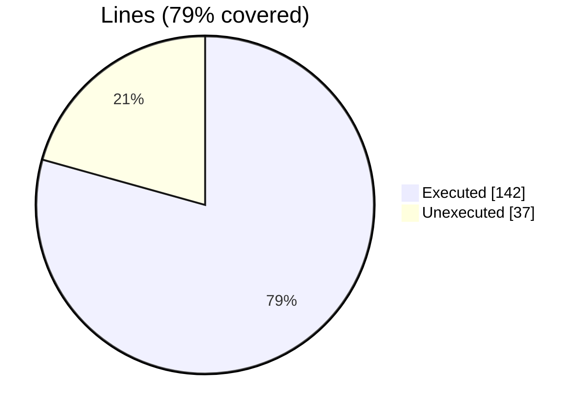
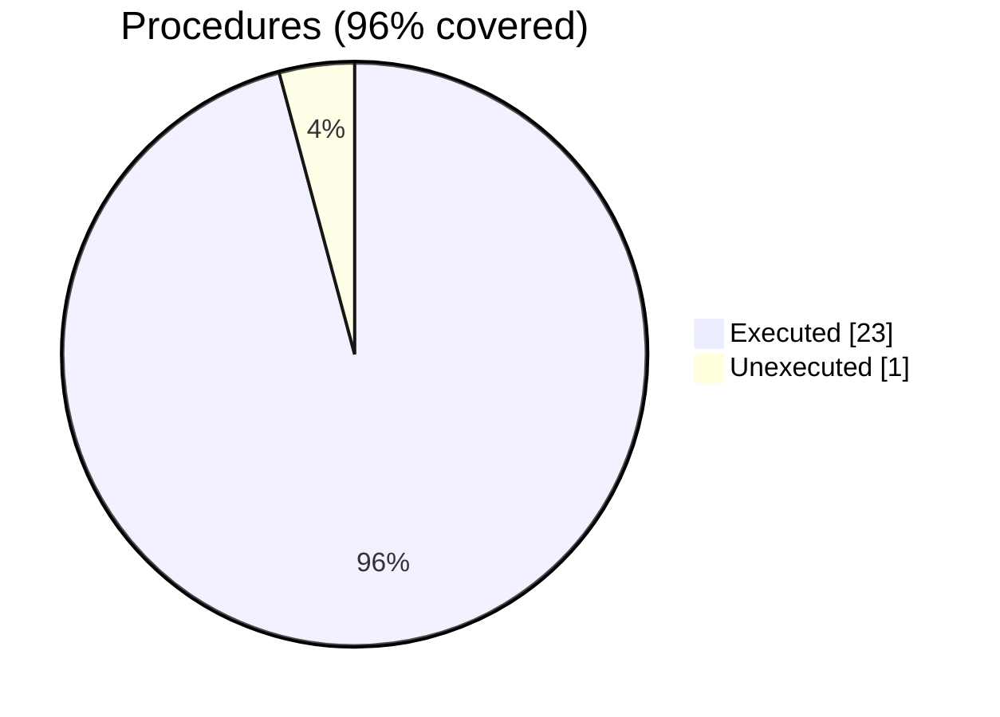

### Coverage analysis of *motion_xdmf_file_object.F90*

|Lines| | |
| --- | --- | --- |
|Executable lines            |179| |
|Executed lines              |142|79%|
|Unexecuted lines            |37|21%|
|Average hits / executed     |571.4507042253521| |

|Procedures| | |
| --- | --- | --- |
|Total procedures            |24| |
|Executed procedures         |23|96%|
|Unexecuted procedures       |1|4%|
|Average hits / executed     |325.39130434782606| |

#### Unexecuted procedures

 + *function* **tag_str**, line 603

#### Executed procedures

 + *subroutine* **write_end_tag**: tested **1060** times
 + *subroutine* **write_start_tag**: tested **1056** times
 + *function* **dataitem_tag_attr**: tested **1044** times
 + *subroutine* **write_dataitem_tag**: tested **1044** times
 + *subroutine* **write_tag**: tested **1044** times
 + *subroutine* **close_attribute_tag**: tested **996** times
 + *subroutine* **open_attribute_tag**: tested **996** times
 + *subroutine* **write_self_closing_tag**: tested **48** times
 + *subroutine* **close_grid_tag**: tested **32** times
 + *subroutine* **open_grid_tag**: tested **32** times
 + *subroutine* **close_geometry_tag**: tested **24** times
 + *subroutine* **open_geometry_tag**: tested **24** times
 + *subroutine* **write_time_tag**: tested **24** times
 + *subroutine* **write_topology_tag**: tested **24** times
 + *function* **new**: tested **5** times
 + *subroutine* **open_file**: tested **5** times
 + *subroutine* **write_header_tag**: tested **5** times
 + *subroutine* **close_file**: tested **4** times
 + *subroutine* **close_domain_tag**: tested **4** times
 + *subroutine* **open_domain_tag**: tested **4** times
 + *subroutine* **write_async_tags**: tested **4** times
 + *subroutine* **gather_async_tags**: tested **4** times
 + *subroutine* **parse_file**: tested **1** times

 --- 
 Report generated by [FoBiS.py](https://github.com/szaghi/FoBiS)