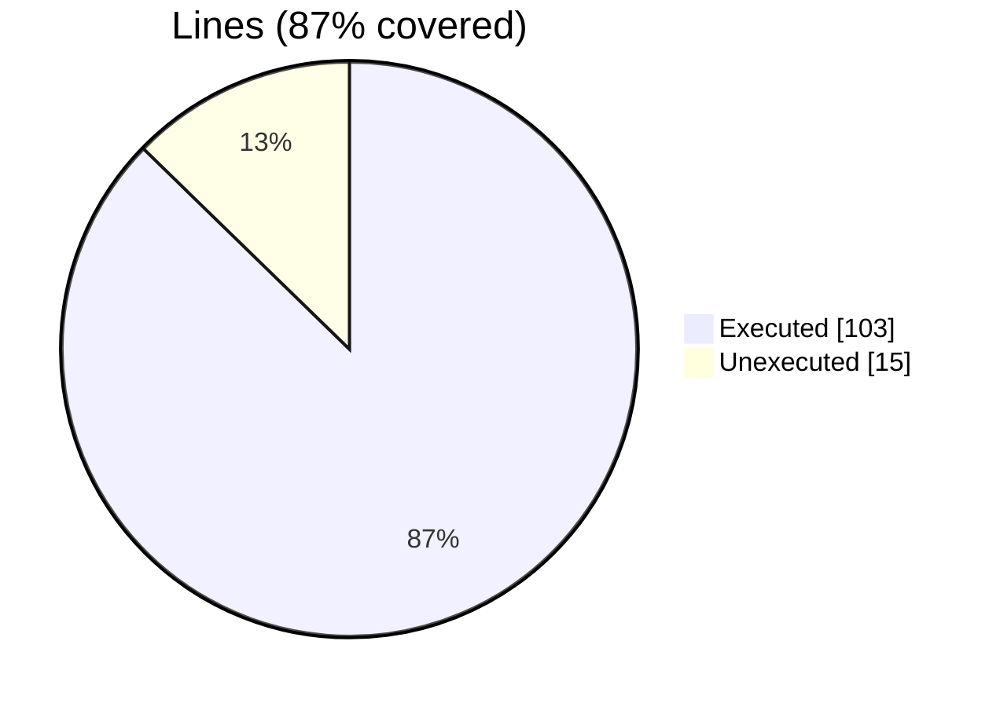
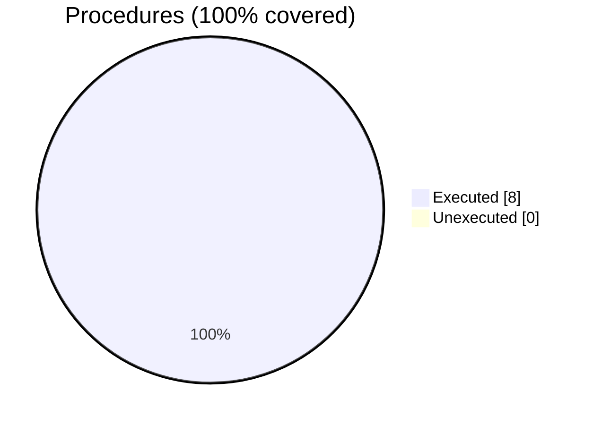

### Coverage analysis of *motion_xh5f_file_object.F90*

|Lines| | |
| --- | --- | --- |
|Executable lines            |118| |
|Executed lines              |103|87%|
|Unexecuted lines            |15|13%|
|Average hits / executed     |195.23300970873785| |

|Procedures| | |
| --- | --- | --- |
|Total procedures            |8| |
|Executed procedures         |8|100%|
|Unexecuted procedures       |0|0%|
|Average hits / executed     |106.125| |

#### Unexecuted procedures

 + *none*

#### Executed procedures

 + *subroutine* **save_block_field_xdmf_tags**: tested **792** times
 + *subroutine* **close_block**: tested **18** times
 + *subroutine* **open_block**: tested **18** times
 + *subroutine* **close_grid**: tested **6** times
 + *subroutine* **open_grid**: tested **6** times
 + *function* **new**: tested **3** times
 + *subroutine* **close_file**: tested **3** times
 + *subroutine* **open_file**: tested **3** times

 --- 
 Report generated by [FoBiS.py](https://github.com/szaghi/FoBiS)