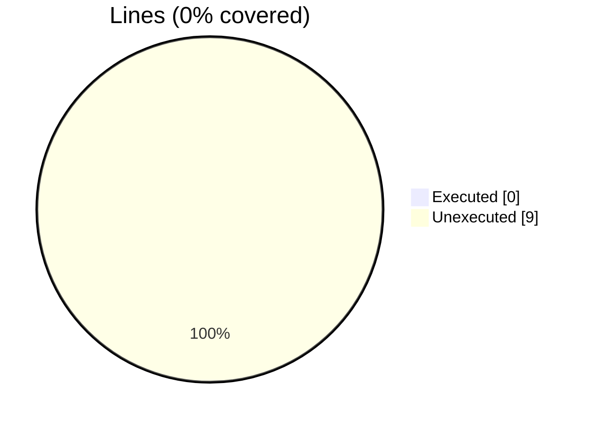
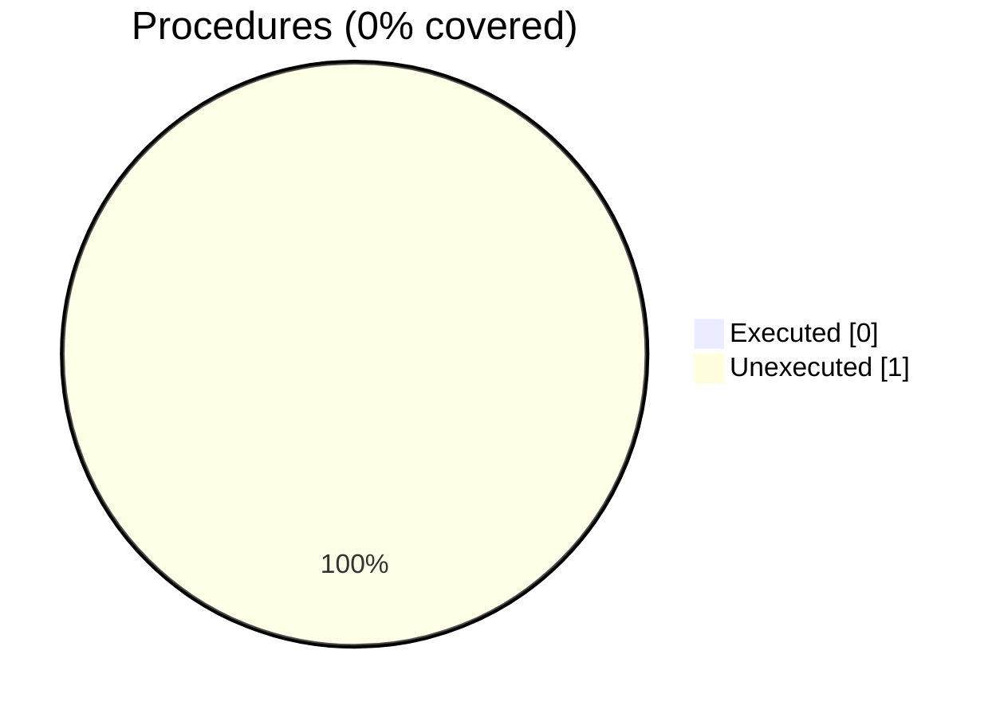

### Coverage analysis of *motion_xh5f_load_save_block_field_agnostic.INC*

|Lines| | |
| --- | --- | --- |
|Executable lines            |9| |
|Executed lines              |0|0%|
|Unexecuted lines            |9|100%|
|Average hits / executed     |0| |

|Procedures| | |
| --- | --- | --- |
|Total procedures            |1| |
|Executed procedures         |0|0%|
|Unexecuted procedures       |1|100%|
|Average hits / executed     |0| |

#### Unexecuted procedures

 + *subroutine* **LOAD_BLOCK_FIELD_KKP_0D**, line 2

#### Executed procedures

 + *none*

 --- 
 Report generated by [FoBiS.py](https://github.com/szaghi/FoBiS)